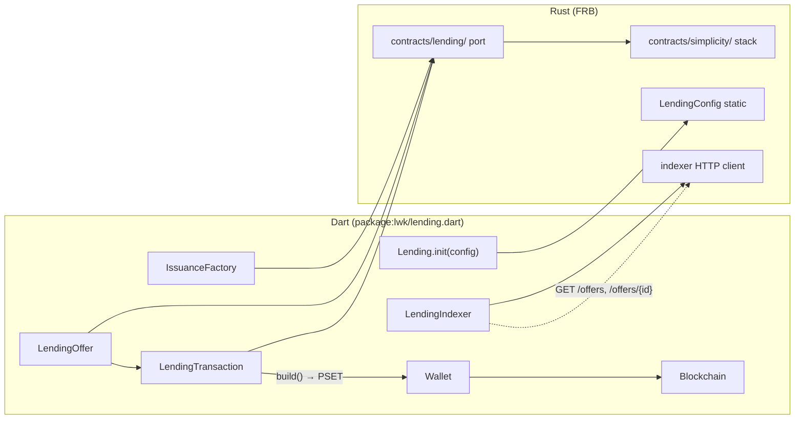

# Simplicity Lending API

Design for integrating [BlockstreamResearch/simplicity-lending](https://github.com/BlockstreamResearch/simplicity-lending) into lwk-dart. Domain vocabulary lives in `CONTEXT.md`; architectural decisions in `docs/adr/`.

## Overview

Two surfaces, exported from `package:lwk/lending.dart`:

| Surface | Purpose |
|---------|---------|
| **Lending Protocol API** | Build partial PSETs for the full offer lifecycle |
| **LendingIndexer** | Read-only discovery — list offers, fetch details and status |

Neither surface signs or broadcasts. Callers use existing `Wallet.signTx`, covenant witness finalization, and `Blockchain.broadcastTxBytes`.

Generic asset issuance (`issue-asset`, `reissue-asset`) is **out of scope** — users supply principal and collateral assets. Protocol-specific setup (utility NFTs, issuance factory) **is** in scope.

## Architecture



Internal Simplicity primitives (`doc/simplicity.md`) are the foundation for the port and remain **not** exported from `package:lwk/lwk.dart`.

## Public types

| Type | Role |
|------|------|
| `LendingOffer` | Stateful offer: parameters + on-chain storage (`is_active`, `current_debt`). Methods: `attachCreation`, `attachAcceptance`, `attachCancellation`, `attachRepayment`, `attachLiquidation`, etc. |
| `IssuanceFactory` | Stateful factory for protocol-specific utility NFT issuance setup |
| `LendingTransaction` | Lending-specific tx builder wrapping internal PSET machinery; passed to `attach*` methods |
| `LendingIndexer` | Read-only indexer client |

Supporting contracts (`script_auth`, `asset_auth`, `asset_auth_vault`) are internal to the Rust port.

## Configuration

Call after `LibLwk.init()`:

```dart
await Lending.init(config: LendingConfig(
  network: LiquidNetwork.testnet,
  indexerBaseUrl: 'http://localhost:8000', // optional override
  allowMainnet: false,
));
```

- **Testnet** is the supported v1 network.
- **Mainnet** requires `allowMainnet: true`; calls fail without it.
- Re-init **replaces** config (useful in tests; production should init once).

## Transaction flow

Typical lender flow:

1. `LendingIndexer.listOffers()` — discover pending offers
2. `LendingIndexer.getDetails(id)` — fetch UTXOs and parameters
3. `LendingOffer.fromDetails(...)` — parse offer state
4. `LendingTransaction.new()` + `offer.attachAcceptance(tx, utxos...)`
5. `tx.build()` → partial PSET
6. `wallet.signTx(...)` — native inputs
7. Covenant witness finalization (Simplicity stack, internal)
8. `Blockchain.broadcastTxBytes(...)`

Borrower creation follows the upstream CLI example (`crates/cli/examples/loan_repayment_flow.md`): utility NFT setup → pre-lock (pending offer) → activation → repay/claim. See GitHub issues for implementation phases.

## Contract sources

`.simf` files live in the **`vendor/simplicity-lending` git submodule** (upstream path: `crates/contracts/simf/`). The pinned rev is the submodule commit recorded in the parent repo. Rust loads sources via `include_str!` in `rust/src/contracts/lending/simf/mod.rs`.

After cloning, initialize submodules:

```bash
git submodule update --init --recursive
```

Upgrades: bump the submodule commit, re-run integration tests.

Upstream programs: `lending.simf`, `asset_auth.simf`, `asset_auth_vault.simf`, `issuance_factory.simf`, `script_auth.simf`.

See `docs/adr/0003-lending-contract-sources-submodule.md`.

## Indexer endpoints

From simplicity-lending `crates/indexer` (read-only):

| Method | Path | Purpose |
|--------|------|---------|
| GET | `/offers` | List offers |
| GET | `/offers/{id}` | Offer details |
| GET | `/offers/overview` | Aggregated overview |
| GET | `/offers/by-script` | Lookup by script |

Default testnet base URL TBD at implementation time (demo uses port 8000).

## Testing

| Layer | Scope | CI |
|-------|-------|-----|
| Rust offline e2e | Full offer lifecycle with fixture UTXOs | Always runs |
| Live testnet + indexer | Real HTTP and Esplora | `#[ignore]` / manual |

Pattern matches existing `rust/src/contracts/simplicity/integration_test.rs` and ignored `test_broadcast`.

## Implementation phases

1. Submodule `.simf` + module scaffold + `LendingTransaction`
2. `LendingOffer` — pending creation spike (`newPending`, `attachCreation`)
3. `LendingOffer` — full lifecycle (accept, cancel, repay, liquidate, claim)
4. `IssuanceFactory` + utility NFT setup flow
5. `LendingIndexer` (Rust HTTP + FRB)
6. `lib/lending.dart` exports + `Lending.init`
7. Live testnet integration test (ignored in CI)

Track progress via GitHub issues on [`emjshrx/lwk-dart`](https://github.com/emjshrx/lwk-dart) (epic: #1).

## References

- Upstream: https://github.com/BlockstreamResearch/simplicity-lending
- Internal primitives: `doc/simplicity.md`
- Glossary: `CONTEXT.md`
- ADRs: `docs/adr/0001-*.md`, `docs/adr/0002-*.md`, `docs/adr/0003-*.md`
